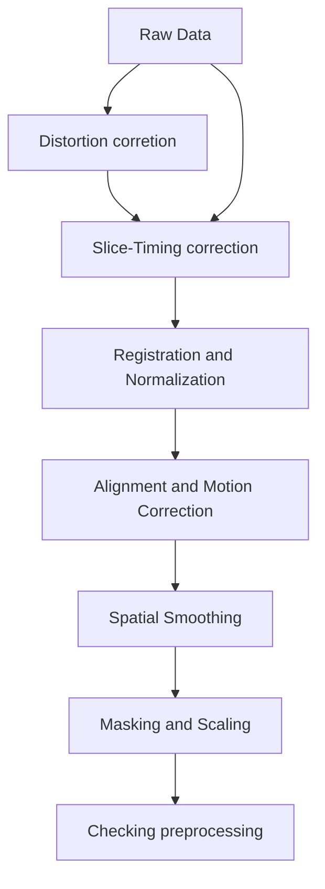

A standard preprocessing pipeline of fMRI data looks as the follows:



A typical code for running `fmriPrep` with singularity is as follows:

```bash
 
singularity run \
	--bind $bids_dir \
	--bind $scratch_dir \
	--bind $dss_dir \
	$prepimg $bids_dir $bids_dir/derivatives/fmriprep \
	participant \
	--participant-label ${participants_to_run[*]} \
	--skip-bids-validation \
	--fs-license-file $proj_dir/fsl_licence.txt \
	--output-spaces MNI152NLin2009cAsym T1w fsnative\
	--bold2t1w-init register \
	--bold2t1w-dof 12 \
	--fs-no-reconall \
	--force-bbr \
	--skull-strip-t1w force \
	--nthreads 56 \
	--omp-nthreads 12 \
	--mem_mb 56000 \
	--stop-on-first-crash \
	--notrack \
	-v \
	-w $scratch_dir
```

Other bash scripts just set variables and environments to run the above singularity docker `fmriprep`.  Please refer to the official website for meanings of those parameters. 

The following is an example of running parallel computing via Linux cluster slurm:
```bash
#!/bin/bash
#
#SBATCH --job-name=ds_fmriprep
#SBATCH --get-user-env
#SBATCH --clusters=cm2_tiny
#SBATCH --partition=cm2_tiny
#SBATCH -t 24:00:00
#SBATCH --nodes=1
#SBATCH --ntasks-per-node=1
#SBATCH --cpus-per-task=56
#SBATCH --mail-user=user@email_address
#SBATCH --mail-type=BEGIN,END,FAIL
#SBATCH --array=1-6%6
#SBATCH -o /dss/dssfs03/ub111/ub111-dss-0001/tmp/suppression_fmripre-%A_%a.log

# for linux cluster interactive
module load slurm_setup
module use $HOME/spack/modules/x86_avx2/linux-sles15-haswell
module load singularity squashfs

# Print job submission info
echo "Slurm job ID: " $SLURM_JOB_ID
date

# setup folders
dss_dir=/dss/dssfs03/ub111/ub111-dss-0001 #DSS storage
proj_dir=${dss_dir} #project paraent folder
proj_name=distractor_suppression # project name
bids_dir=$proj_dir/$proj_name # bids directory
echo $bids_dir

prepimg=${dss_dir}/fmriprep-23.1.4 # fmriprep image sandbox

#. working directory 
# if exist $SCRATCH, use it, otherwise use dss_dir/tmp
if [ -z "$SCRATCH" ]; then
    scratch_dir=$dss_dir/tmp/${proj_name}
else
    scratch_dir=$SCRATCH/${proj_name}
fi
echo $scratch_dir
# check if the folder exists
if [ ! -d "$scratch_dir" ]; then
    mkdir "$scratch_dir"
fi

export MPLCONFIGDIR=$scratch_dir  #matplotlib temp folder

# manually set participant groups
# finished: "DS001" "DS004" "SS022" "SS034" "DS016" "DS002" "DS005" "DS018" "DS032" "SS012" "SS008" "SS024" "DS033" "SS007" "SS020" "DS034" "SS017" 
# 

group1=("SS015" "SS028" "DS021")
group2=("SS030" "DS020" "DS023") 
group3=("DS029" "DS010" "DS027")  
group4=("SS014" "SS026" "SS033")
group5=("SS003" "SS019" "SS031")
group6=("DS011" "DS024")

# Select participant group based on SLURM_ARRAY_TASK_ID
case $SLURM_ARRAY_TASK_ID in
    1)
        participants_to_run="${group1[@]}"
        ;;
    2)
        participants_to_run="${group2[@]}"
        ;;
    3)
        participants_to_run="${group3[@]}"
        ;;
    4)
        participants_to_run="${group4[@]}"
        ;;
    5)
        participants_to_run="${group5[@]}"
        ;;
    6)
        participants_to_run="${group6[@]}"
        ;;
esac


singularity run \
    --bind $bids_dir \
    --bind $scratch_dir \
    --bind $dss_dir \
    $prepimg $bids_dir $bids_dir/derivatives/fmriprep \
    participant \
    --participant-label ${participants_to_run[*]} \
    --skip-bids-validation \
    --fs-license-file $proj_dir/fsl_licence.txt \
    --output-spaces MNI152NLin2009cAsym T1w fsnative\
    --bold2t1w-init register \
    --bold2t1w-dof 12 \
    --fs-no-reconall \
    --force-bbr \
    --skull-strip-t1w force \
    --nthreads 56 \
    --omp-nthreads 12 \
    --mem_mb 56000 \
    --stop-on-first-crash \
    --notrack \
    -v \
    -w $scratch_dir

#    --cifti-output 91k \
#    --medial-surface-nan \

# remove scratch (remember to remove it when all finished)
# if it has multiple jobs, remove it after all jobs are finished, ... not here. 
# rm -rf $scratch_dir
