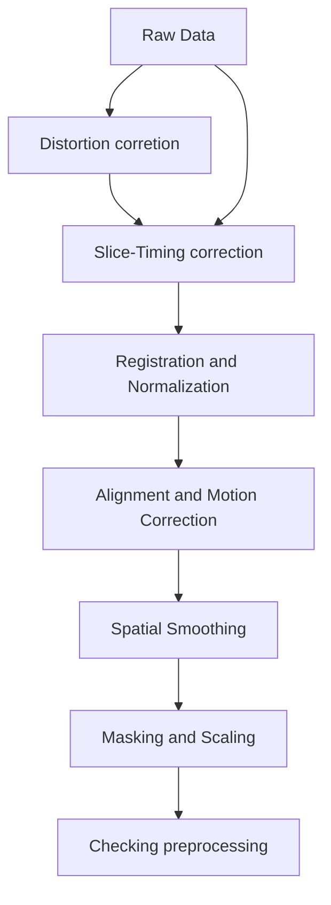

> [!info] Overview
> This is the initial step of MRI data processing after you have organized your data in the BIDS structure. This tutorial guides you through
>  1. Installation of Docker and Neurodesktop image
>  2. Quality check with MRIQC
>  3. Preprocessing with fMRIPrep

> [!Requirement (Hardware and Licences)]
>  - RAM : ≥ 16 GB (MRIQC/fMRIPrep are memory‑hungry)
>  - DISK: ≥ 20 GB free (container + derivatives)
>  - A FreeSurfer licence file (license.txt)—register free, save it in the project root. 

## 1 · Install Docker

### Windows / macOS (Docker Desktop)  

1. Download the ****Docker Desktop**** installer from the [official docs](\[docs.docker.com]\(https://docs.docker.com/desktop/setup/install/windows-install/?utm_source=chatgpt.com\)).
2. Run the installer → accept WSL 2 backend on Windows if prompted.
3. After reboot open *Docker Desktop* and ensure the whale icon is running in the system tray.  

Verify:

```bash
docker run hello-world
```
  
## 2 · Pull & launch Neurodesktop

Instructions on installing and using the app: [https://www.neurodesk.org/docs/getting-started/neurodesktop/neurodeskapp/](https://www.neurodesk.org/docs/getting-started/local/neurodeskapp/)

Launching the Neurodesk App

The Neurodesk App can be launched directly from your operating system’s application menu, or by running the `neurodeskapp` command in the command line.


### Add  a custom Data Directory

By default, /home/jovyan/neurodesktop-storage in the app (which is bound with local directory ~/neurodesktop-storage in Unix/MacOS or C:/neurodesktop-storage in Windows)

By choice, in the settings window below, select `Additional Directory` on the left side bar, click `Change` button to select the local directory, then click `Apply & restart`. The next time you start the app, the data from the local directory can be found in /home/jovyan/data. This is where you can read and analyze your MRI data. 


  ![[neurodesk-settings.png]]

> [!Info]
> If you are using Windows it is currently not possible to mount external hard drives. We recommend copying data from the external drive to your local disk first and then processing it in Neurodesk.


After you successfully added an external folder, you should see a similar interface as follows. If you are familiar with the Jupyter Notebook interface, you can directly work here. If you prefer `Desktop`, then you can double click on `Neurodesktop`, it will open a virtual linux desktop for you. 

![[neurodesk_interface1.png]]

Within the `Neurodesktop`, you can open related Apps. 
![[neuro-desktop.png]]
## Understand Neurodesktop Modules

> [!info] What are modules?  
> Neurodesktop exposes each neuroimaging tool as an Lmod “module” backed by Singularity containers served over CVMFS.

**Location**  
Modules live on CVMFS under `/cvmfs/neurodesk.ardc.edu.au/neurodesk-modules/`, with one folder per tool/version (e.g. `fmriprep/2025-06-10`)  [oai_citation:0‡GitHub](https://raw.githubusercontent.com/NeuroDesk/neurodesktop/main/config/jupyter/before_notebook.sh).

**MODULEPATH**  
The `MODULEPATH` environment variable points to `/cvmfs/neurodesk.ardc.edu.au/containers/modules/`, so that Lmod can find and load the correct wrapper scripts automatically  [oai_citation:1‡Docker Hub](https://hub.docker.com/layers/vnmd/neurodesktop/20230825/images/sha256-b132aa7ad43d7ea4a50b8e1031ac1772370f90f14b4b5a4693a425c9e1d6b66f?utm_source=chatgpt.com).

**Loading modules**  
In any Neurodesktop terminal you can manually initialize and inspect available tools:
```bash
#module use /cvmfs/neurodesk.ardc.edu.au/neurodesk-modules/
module avail                     # list all tools/versions
module load fmriprep/latest     # load fmriprep into your env
```


## 3  Code inside the container with VS Code

  The most handy App is `Visual Studio Code`. If you are familiar with VS Code, this would be your choice. 

  ![[neurodesk-vscode.png]]

## 4. Preprocessing with fMRIPrep

*fMRIPrep* is a preprocessing pipeline for functional magnetic resonance imaging (fMRI) data. It offers an accessible, state-of-the-art interface that handles variations in scan protocols with minimal user input. The pipeline provides clear and comprehensive error and output reports. It performs essential processing steps, including `coregistration, normalization, unwarping, noise component extraction, segmentation`, and `skull stripping`. The outputs are easily suitable for various group-level analyses, including task-based and resting-state fMRI, graph theory measures, and surface or volume-based approaches.

A standard preprocessing pipeline of fMRI data looks as follows:



The _fMRIPrep_ workflow takes as principal input the path of the dataset that is to be processed. The input dataset is required to be in valid BIDS format, and it must include at least one T1w structural image and (unless disabled with a flag) a BOLD series.

The standard parts of the command follow the BIDS-Apps definition, such as:

	fmriprep data/bids_root/ out/ participant -w work. 

### 4.1 Using module `fMRIPrep`

In the Neurodesk container, you can either edit the bash file (preferred) or run it directly with the command line. 

```bash
module load fmriprep # load fmriprep module

#specify input BIDS folder and output folder, as well as working folder (storing temperary files)
BIDS_DIR=~/data/ncp_2025
OUTPUT_DIR=$BIDS_DIR/derivatives/fmriprep
WORK_DIR=~/data/work

```

Next, you can run `fmriprep` directly. For example, the following command runs preprocessing for the given BIDS_DIR with subject ID {001, 002, 003}, without Freesurfer surface preprocessing, and output spaces are `MNI152NLin2009cAsym` and local `T1w` spaces. It will use up to 6 threads with 16 GB of memory. 

```bash
fmriprep $BIDS_DIR $OUTPUT_DIR participant \
  --participant-label 001 002 003 \
  --skip-bids-validation \
  --fs-license-file $BIDS_DIR/license.txt \
  --fs-no-reconall \
  --output-spaces MNI152NLin2009cAsym T1w \
  --nthreads 6 \
  --mem_mb 16000 \
  --work-dir $WORK_DIR \
  --verbose
```


### 4.2 Use `Singularity`

If you set up a dedicated Linux server with `Singularity` installed, you can download the fmriPrep image and run it remotely. Here is a typical code for running fmriprep (assuming you have specified the image location with `preimg`). 

```bash
 
singularity run \
	--bind $bids_dir \
	--bind $scratch_dir \
	--bind $dss_dir \
	$prepimg $bids_dir $bids_dir/derivatives/fmriprep \
	participant \
	--participant-label ${participants_to_run[*]} \
	--skip-bids-validation \
	--fs-license-file $proj_dir/fsl_licence.txt \
	--output-spaces MNI152NLin2009cAsym T1w fsnative\
	--bold2t1w-init register \
	--bold2t1w-dof 12 \
	--fs-no-reconall \
	--force-bbr \
	--skull-strip-t1w force \
	--nthreads 56 \
	--omp-nthreads 12 \
	--mem_mb 56000 \
	--stop-on-first-crash \
	--notrack \
	-v \
	-w $scratch_dir
```


### 4.3 Run with Linux cluster `slurm`

Additionally, it is possible to run fMRIPrep using [Neurocommand on a Linux cluster](https://www.neurodesk.org/docs/getting-started/neurocommand/linux-and-hpc/). 
The following is an example of running parallel computing via Linux cluster slurm via LRZ linux cluster. 

```bash
#!/bin/bash
#SBATCH --job-name=fmriprep
#SBATCH --get-user-env
#SBATCH --clusters=cm4
#SBATCH --partition=cm4_tiny
#SBATCH -t 12:00:00
#SBATCH --nodes=1
#SBATCH --ntasks-per-node=1
#SBATCH --cpus-per-task=32
#SBATCH --mem=32G
#SBATCH --array=01-23%4
#SBATCH --mail-user=your@email
#SBATCH --mail-type=BEGIN,END,FAIL

#SBATCH -o /dss/youraccount_folder/fmripre-%A_%a.log
# for linux cluster interactive

module load slurm_setup
module use $HOME/spack/modules/x86_avx2/linux-sles15-haswell
module load singularity squashfs
module load fmriprep

# Print job submission info
echo "Slurm job ID: " $SLURM_JOB_ID
date

#Directory

BIDS_DIR=$HOME/dss/studies/Your_Study
OUT_DIR=$BIDS_DIR/derivatives/fmriprep

WORK_DIR=$SCRATCH/fmriprep_work

mkdir -p "$WORK_DIR" "$OUT_DIR"

export MPLCONFIGDIR=$SCRATCH #matplotlib temp folder

SUBJECT=$(printf "%03d" $SLURM_ARRAY_TASK_ID)

fmriprep \
	"$BIDS_DIR" "$OUT_DIR" participant \
	--participant-label "$SUBJECT" \
	--skip-bids-validation \
	--fs-license-file $HOME/dss/fsl_licence.txt \
	--output-spaces MNI152NLin2009cAsym T1w\
	--fs-no-reconall \
	--nthreads 32 \
	--mem 32000 \
	--stop-on-first-crash \
	-vv \
	-w $SCRATCH

echo "Job $SLURM_JOB_ID finished at $(date)"
```


>[!Note] 
>For multi-line commands, you need to add `\` at the end of each line, and be aware that you should NOT add any blank spaces after `\`.

## 5 Check fMRIPrep outputs & confounds

> [!summary]
> **Goal:** decide which nuisance signals to keep (and how many) before denoising.  
> We’ll walk through the HTML report, inspect the `confounds_regressors.tsv`, and script our own plots using `nilearn.interfaces.fmriprep.load_confounds`.

By default, the fMRIPrep will generate output at subfolder `/derivatives/fmriprep`:
```
└─ derivatives/fmriprep/
   ├─ logs/
   ├─ dataset_description.json
   ├─ sub-001/
   │  ├─ anat/
   │  ├─ figures/
   │  ├─ func/
   │  └─ log/ 
   ├─ sub-001.html (visual report)
   └─ ... 

```
### 5.1 Locate the QA material
* Each subject has a visual report at  
  `<derivatives>/fmriprep/sub-<ID>.html`, plus figures inside `sub-<ID>/figures/`.  [oai_citation:0‡fmriprep.org](https://fmriprep.org/en/stable/outputs.html)  It includes anatomy and functional images reports. 

The **first step** is to scroll to the bottom and check if there are any error reports. 
Next, verify the `brain masks`, `spatial normalization`, and `coregistration` of functional and anatomical MRI. 
#### Visual Report: Functional Section

This section is most important for fMRI studies. It includes a summary that describes the functional data. The collected confounds are listed for each run. 

* Brain mask and (anatomical/temporal) CompCor ROIs.
![[sub-004_task-visualattention_desc-rois_bold.svg]]
Here, aCompCor (magenta contour) and tCompCor (Blue contour pick the top 2% most variable voxels within the brain masks) aim to model physiological and other voxel-wise variance using PCA over CSF/WM masks or high-variance voxels. Additionally, the brain edge (or crown) ROI is marked as a green contour. Verify these contours if any outliers occur. In addition to this, the report’s *“Variance explained by a/crown/tCompCor components”* panel shows cumulative variance curves for every CompCor mask, showing the number of components that must be included in a model to explain some fraction of variance (50%, 70% or 90%). 

The most important subsection is `BOLD Summary` panel. One example as the below. 
* FD measures the sum of absolute head-motion derivatives between frames (Power et al., 2012).  [oai_citation:9‡PMC](https://pmc.ncbi.nlm.nih.gov/articles/PMC3254728/?utm_source=chatgpt.com)  
* DVARS is the root-mean-square signal change across all voxels; spikes above ≈5 % signal are typical flags.  [oai_citation:10‡PMC](https://pmc.ncbi.nlm.nih.gov/articles/PMC5915574/?utm_source=chatgpt.com)  
* fMRIPrep marks volumes with FD > 0.5 mm or stdDVARS > 1.5 as `motion_outlierXX` by default (tune with `--fd-spike-threshold`, `--dvars-spike-threshold`).  [oai_citation:11‡Neurostars](https://neurostars.org/t/impact-of-fd-and-dvars-on-preprocessing-in-fmriprep/30443)  

![[sub-004_task-visualattention_desc-carpetplot_bold.svg]]

The bottom carpet plot visualize the entire BOLD time series across all voxels as a 2D matrix (time x voxels), enabling rapid assessment of data quality, physiological artifacts, and motion-related spikes. 
Overlaid confound traces (e.g., Framewise Displacement, DVARS, global signal, WM, CSF) help link visual anomalies to quantitative metrics. By inspecting patterns—such as vertical streaks for sudden motion, horizontal bands for scanner drifts, or crown-region fluctuations—you can decide whether to apply censoring, adjust regressors, or flag problematic runs.

**Interpreting Patterns:**

- **`Motion Artifacts`**: **Vertical stripes** across all rows at a single time point indicate a sudden head-motion event; corroborate with FD spikes
- **`Physiological Noise`**: **Oscillatory horizontal bands** within CSF or WM regions reflect cardiac or respiratory cycles; these may persist as rhythmic patterns. 
- `Scanner Drifts`:  **Gradual shifts** in baseline intensity across all tissues may indicate scanner instability; appear as sloped color transitions. 
- `Crown Effects`: The “crown” rows (outer brain edge) often show artifactual jumps from head or neck movements; flagging crown-specific stripes can isolate edge-based noise

Finally, a heat-map titled *“Correlations among nuisance regressors”* visualises their pair-wise $r$ plus correlation to GS.  [oai_citation:3‡fmriprep.org](https://fmriprep.org/en/stable/_static/SampleReport/sample_report.html)  

### 5.2 Understand what’s stored
* All confounds live in  
  `sub-<ID>_task-<task>_run-<run>_desc-confounds_timeseries.tsv`. Columns include `std_dvars`, `framewise_displacement`, 6 rigid-body parameters, t/a CompCor PCs, global/WM/CSF signals and any motion outliers.  [oai_citation:4‡fmriprep.org](https://fmriprep.org/en/1.5.2/outputs.html)  
* JSON sidecars add metadata such as `CumulativeVarianceExplained` for every CompCor component, so you can choose *k* components that explain (say) 50 % variance.  [oai_citation:5‡fmriprep.org](https://fmriprep.org/en/stable/outputs.html?utm_source=chatgpt.com)  
* fMRIPrep keeps only the PCs needed to reach 50 % by default (`--return-all-components` overrides).  [oai_citation:6‡Neurostars](https://neurostars.org/t/fmriprep-acompcor-from-wm-csf-masks/19535?utm_source=chatgpt.com) [oai_citation:7‡Neurostars](https://neurostars.org/t/fmriprep-acompcor-from-wm-csf-masks/19535?utm_source=chatgpt.com)  

